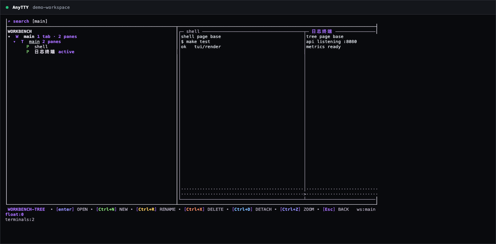
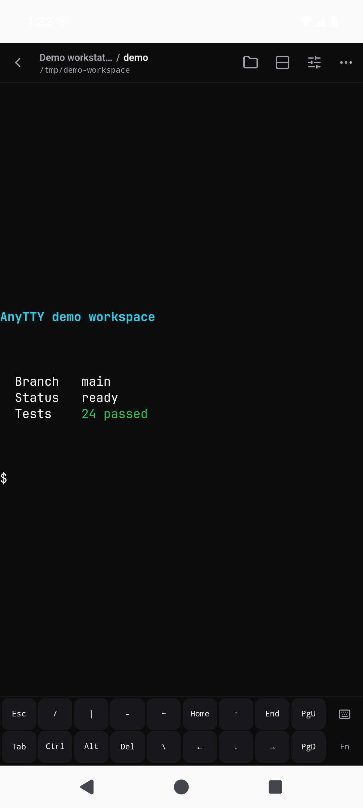
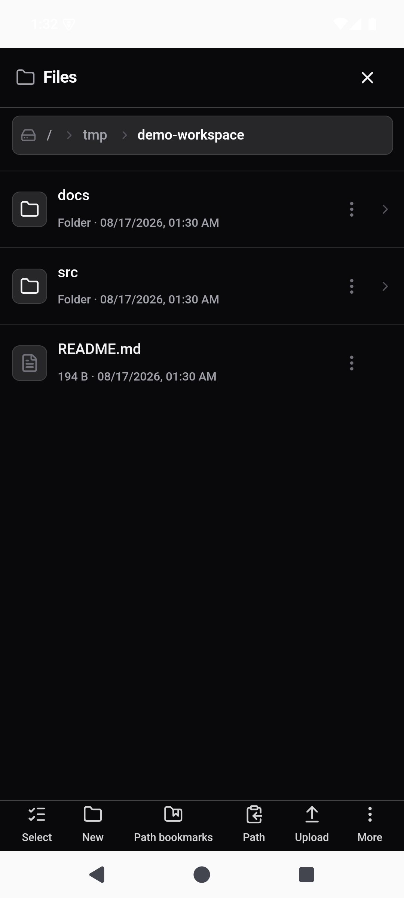

# AnyTTY

English | [简体中文](README.zh-CN.md)

AnyTTY keeps terminal sessions running on your own machines and lets you return to them from a keyboard-first TUI, the CLI, or a mobile app. The same connection also gives you a practical file browser for project files, logs, and downloads.

> **Beta:** `v0.0.1-beta.0` is available for macOS, Linux, Windows, and Android. It is ready for evaluation, but protocols and configuration may still change before the first stable release.



## What you can do

- **Keep work alive.** Start a shell, build, server, or log tail once; detach and reconnect without restarting the process.
- **Organize multiple terminals.** Use workspaces, tabs, split panes, floating panes, search, resize, zoom, and a keyboard-first terminal manager.
- **Work from your phone.** Attach to a live terminal with an extra-key bar designed for `Esc`, `Ctrl`, arrows, paging, and common terminal input.
- **Browse remote files.** Navigate approved paths, preview common document and media formats, upload, download, rename, and select files from the mobile UI.
- **Choose how to connect.** Stay local, reuse SSH, connect directly with WebRTC/ICE-TCP, or use the optional AnyTTY Cloud route when direct reachability is inconvenient.
- **Pair without sharing passwords.** Add a device with a short-lived QR or paste claim. Access is bound to that client and can be revoked from the daemon.

<table>
  <tr>
    <td align="center"></td>
    <td align="center"></td>
  </tr>
  <tr>
    <td align="center"><strong>Live terminal</strong></td>
    <td align="center"><strong>Remote files</strong></td>
  </tr>
</table>

## Install

### macOS and Linux

The installer selects x64 or ARM64, downloads the matching GitHub Release archive, verifies `SHA256SUMS`, and installs to `~/.local/bin` by default.

```sh
curl -fsSL https://raw.githubusercontent.com/anytty/anytty/main/install.sh | sh
```

Choose another directory or version when needed:

```sh
curl -fsSL https://raw.githubusercontent.com/anytty/anytty/main/install.sh | \
  sh -s -- --version v0.0.1-beta.0 --bin-dir "$HOME/bin"
```

### Windows PowerShell

```powershell
Invoke-WebRequest https://raw.githubusercontent.com/anytty/anytty/main/install.ps1 -OutFile install.ps1
.\install.ps1
```

The PowerShell installer verifies SHA-256, installs to `%LOCALAPPDATA%\Programs\AnyTTY\bin`, and adds that directory to the current user's `PATH`. Pass `-NoModifyPath` to leave `PATH` unchanged.

You can also download CLI archives and the unsigned Android beta APK directly from [GitHub Releases](https://github.com/anytty/anytty/releases/tag/v0.0.1-beta.0). Package manager definitions for Homebrew, npm, and WinGet are being prepared; see [package manager publishing](docs/PACKAGE_MANAGERS.md) for their current status.

## Quick start

Start the daemon for your user and open the TUI:

```sh
anytty daemon start
anytty
```

Create a named terminal from the CLI and attach immediately:

```sh
anytty terminal create --name workspace --attach -- zsh
```

List sessions or return to one later:

```sh
anytty terminal list
anytty attach workspace
```

Run `anytty --help` for the complete command list, or continue with the [quick-start guide](https://anytty.github.io/anytty/docs/quick-start.html).

## Mobile app

Install the Android beta APK from the release page, then use **Add device** in the app. On the machine running the daemon, generate a short-lived pairing QR or text claim with `anytty pair create`; scan or paste it into the app. Once paired, the device screen lists running terminals and opens the file browser for the terminal's working directory.

The repository also contains the iOS client source. Store-signed Android and iOS builds are not available yet.

## Connection options

| Route | Best for | Cloud required |
| --- | --- | --- |
| Local | CLI and TUI on the same machine | No |
| SSH | Machines you already reach with OpenSSH | No |
| Direct | Self-managed LAN or internet reachability | No |
| Cloud | Managed discovery, P2P negotiation, and relay fallback | Yes |

Local, SSH, and Direct are fully usable from this repository. The official Cloud route is optional; choosing it changes discovery and transport, not the daemon's authority over terminals and files.

## Build from source

CLI/TUI development requires Go 1.26.5. Shared UI and mobile builds use Node.js 24 and the checked-in npm lockfile.

```sh
git clone https://github.com/anytty/anytty.git
cd anytty
npm ci
make build
```

The binary is written to `.artifacts/bin/anytty`. Run the main checks with `make test`, `make test-clients`, and `npm run public:check`. Android builds additionally require Java 21 and the Android SDK; iOS builds require macOS and Xcode.

## Open-source boundary

The Apache-2.0 repository contains the CLI, TUI, user-owned daemon, shared UI, Android and iOS source, Local/SSH/Direct routes, Cloud clients, public protocols, and the end-to-end authorization path.

It does not contain the proprietary AnyTTY Cloud Controller, Edge server implementation, Cloud Web application, billing, database migrations, production deployment, or service operations. These managed server components are not currently offered as a self-hostable Cloud stack. See the [open-source boundary](docs/OPEN_SOURCE_BOUNDARY.md), [security architecture](ARCHITECTURE.md), and [pairing protocol](docs/PAIRING_PROTOCOL.md) for details.

## Project links

- [Documentation](https://anytty.github.io/anytty/) and [changelog](CHANGELOG.md)
- [Contributing](CONTRIBUTING.md), [governance](GOVERNANCE.md), and [code of conduct](CODE_OF_CONDUCT.md)
- [Security policy](SECURITY.md), [support](SUPPORT.md), and [private vulnerability reporting](https://github.com/anytty/anytty/security/advisories/new)
- [Apache-2.0 license](LICENSE), [NOTICE](NOTICE), [third-party notices](THIRD_PARTY_NOTICES.txt), and [trademark policy](TRADEMARKS.md)

Contributions use the [Developer Certificate of Origin](DCO). AnyTTY names and logos are not granted by the Apache License 2.0.
