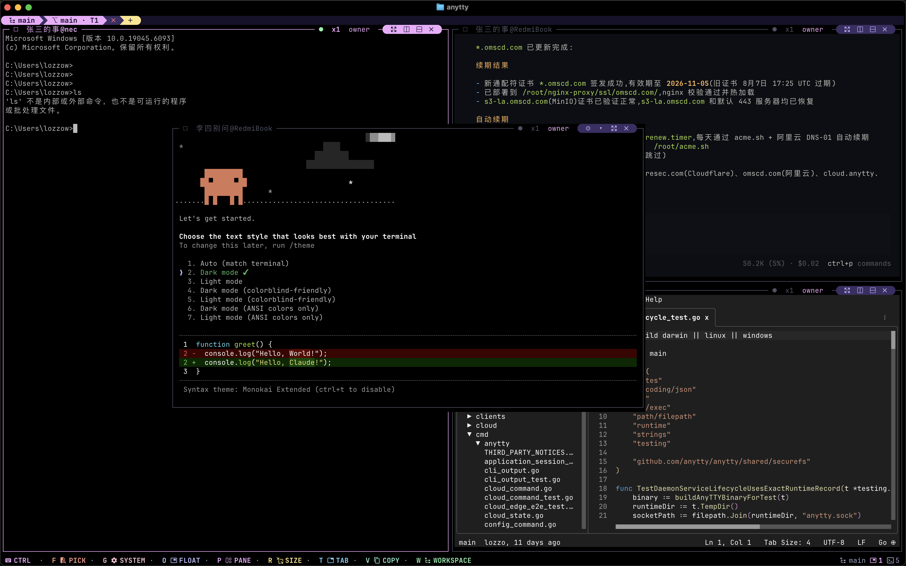
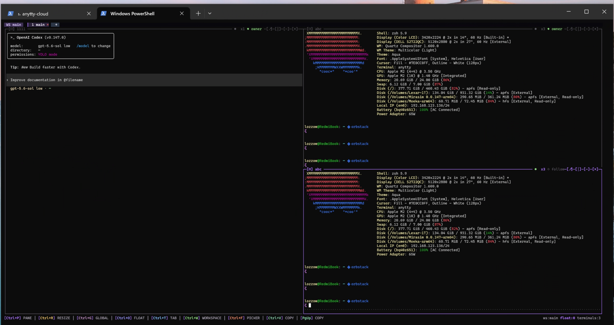
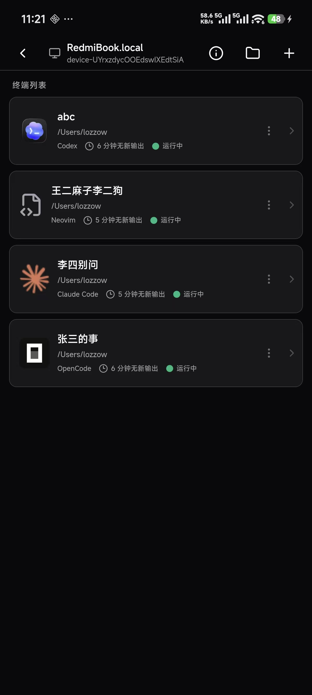
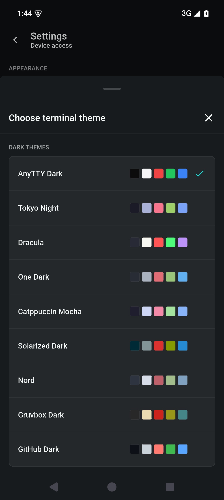
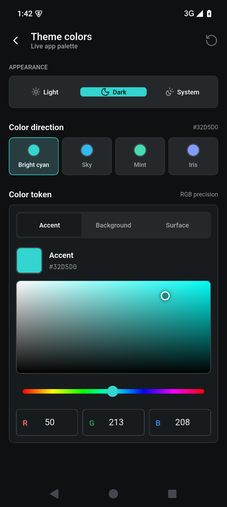
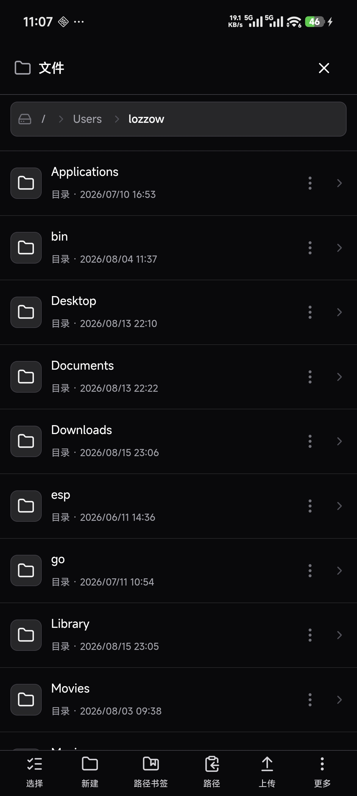
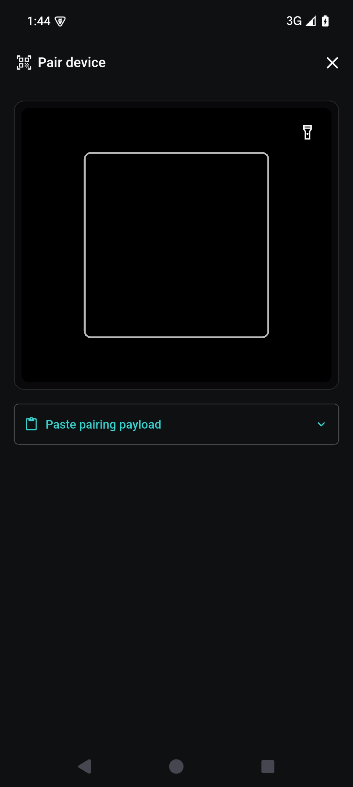
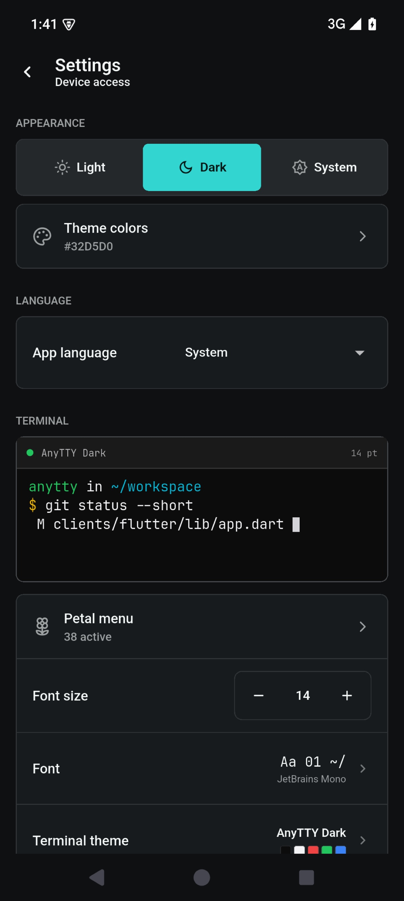
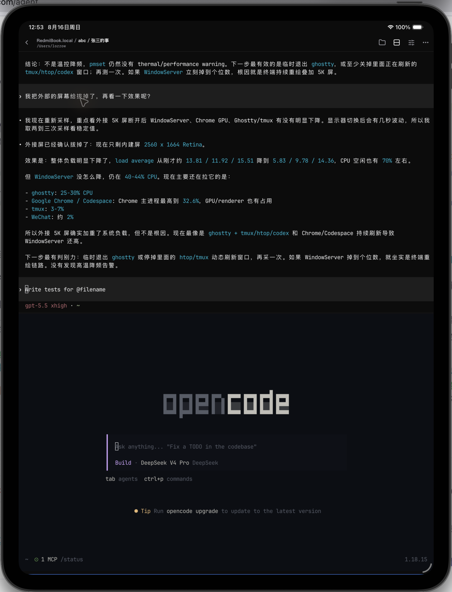
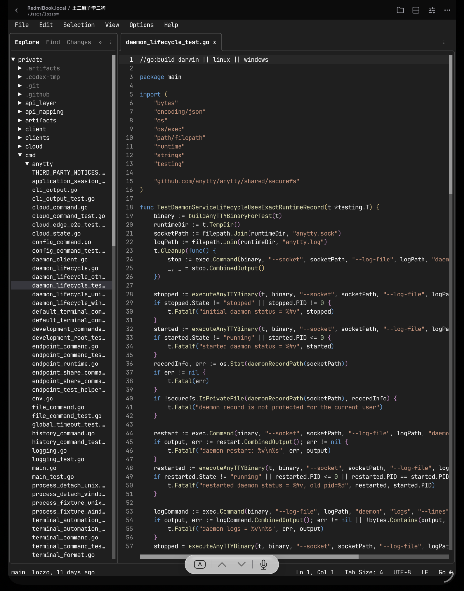

<div align="center">
  
  <h1>AnyTTY</h1>
  <p><strong>Keep terminals running. Come back whenever you need to.</strong></p>
  <p>
    <a href="LICENSE"></a>
    <a href="https://github.com/anytty/anytty/releases"></a>
    <a href="https://github.com/anytty/anytty/releases"></a>
    <a href="https://github.com/anytty/anytty/stargazers"></a>
    <a href="https://github.com/anytty/anytty/actions/workflows/ci.yml"></a>
    <a href="docs/PACKAGE_MANAGERS.md"></a>
  </p>
  <p>English · <a href="README.zh-CN.md">简体中文</a></p>
</div>

AnyTTY keeps terminal sessions running on your own machines, so you can close the window, switch devices, or come back later without losing the work. Use the keyboard-first TUI, CLI, or mobile app to check in, take control, and manage files over the same connection.

> **Beta:** `v0.0.1-beta.5` provides macOS, Linux, and Windows builds, signed Android APKs for ARMv7, ARM64, x86_64, and universal installs, plus a public iOS TestFlight beta. Protocols and configuration may still change before the first stable release.

## Quick install

**macOS / Linux - daemon, CLI, and TUI**

```sh
curl -fsSL https://raw.githubusercontent.com/anytty/anytty/main/install.sh | sh
```

**Windows PowerShell - daemon, CLI, and TUI**

```powershell
irm https://raw.githubusercontent.com/anytty/anytty/main/install.ps1 -OutFile install.ps1
./install.ps1
```

**Mobile app**

- iPhone and iPad: [join the public beta on TestFlight](https://testflight.apple.com/join/rfcgFyJh).
- Android: [download the Beta APK for your device from GitHub Releases](https://github.com/anytty/anytty/releases/tag/v0.0.1-beta.5).

<table>
  <tr>
    <td align="center"></td>
    <td align="center"></td>
  </tr>
  <tr>
    <td align="center"><strong>macOS: splits, floating panels, and remote terminals</strong></td>
    <td align="center"><strong>Windows: local and remote terminals in one workspace</strong></td>
  </tr>
</table>

## Key features

- **Close the window, keep the work running.** A `terminal` is a task kept alive by the daemon. TUI `workspaces` and `panels` are just views, so switching which terminal a panel shows doesn't change your layout or restart the task.
- **A slow phone won't slow the task.** TUI panels, the CLI, WebView, and mobile apps each read the latest screen snapshot at their own pace. A slow client can catch up later without making the terminal process wait.
- **Windows, macOS, and Linux all work the same way.** Windows is a first-class platform. The CLI, TUI, and daemon ship for Windows x64 and ARM64, with no WSL required for core functionality.
- **Local and remote terminals in one place.** Local, SSH, Direct, and Cloud terminals appear in the same picker and can be viewed, switched, and operated like local terminals. Remote AI agents can become part of the same workflow.
- **History that doesn't eat memory.** Terminal output is written to history files while the live view keeps only bounded data. There is no fixed history line limit; practical capacity depends on disk space. After a crash, disconnect, or long unattended run, you can recover full context.
- **Find terminals that stopped updating.** The mobile terminal list and TUI picker show status and recent activity together, so you can spot sessions with no new output and decide whether a task is still running.
- **Take control from different devices.** The same terminal can move between the TUI, CLI, embedded WebView, and Android or iOS mobile apps without migrating or restarting the process. Mobile is optimized for touch, with extra keys for `Esc`, `Ctrl`, arrows, paging, and other common actions.
- **Reach private-network machines without exposing them.** The optional AnyTTY Cloud service helps daemons behind NAT or private networks establish P2P connections, with automatic Relay fallback when a direct path is unavailable.
- **Remote connections are encrypted by default.** SSH, Direct, and Cloud routes use authenticated, encrypted connections. Pairing access is bound to a specific client and can be revoked from the daemon. A Relay forwards encrypted traffic without gaining terminal or file permissions.
- **Terminals and files share one connection.** AnyTTY also supports file browsing, upload, download, rename, and selection. After connecting to a remote machine, you can work with authorized files on that machine just as you work with its terminals.
- **Mobile file management and rich previews.** The mobile app includes a file manager that browses remote directories and previews common text, document, image, media, and 3D formats. Logs, configuration, build results, and downloads can be inspected without switching apps.

### Mobile terminals

<table>
  <tr>
    <td align="center"></td>
    <td align="center"></td>
    <td align="center"></td>
  </tr>
  <tr>
    <td align="center"><strong>Multi-terminal status and recent activity</strong></td>
    <td align="center"><strong>Quickly find terminals with fresh output</strong></td>
    <td align="center"><strong>Take control with the extra-key bar</strong></td>
  </tr>
</table>

> **Install the app:** The mobile app supports both Android and iOS. Download a signed Android Beta APK from [GitHub Releases](https://github.com/anytty/anytty/releases/tag/v0.0.1-beta.5), or [join the public iOS beta on TestFlight](https://testflight.apple.com/join/rfcgFyJh).

### Connections and file management

<table>
  <tr>
    <td align="center"></td>
    <td align="center"></td>
  </tr>
  <tr>
    <td align="center"><strong>Local, Cloud, and P2P paths</strong></td>
    <td align="center"><strong>Remote file management</strong></td>
  </tr>
</table>

### Rich online file previews

<table>
  <tr>
    <td align="center"></td>
    <td align="center"></td>
  </tr>
  <tr>
    <td align="center"><strong>Document preview, search, and zoom</strong></td>
    <td align="center"><strong>Interactive 3D model preview</strong></td>
  </tr>
</table>

### Tablet multitasking and terminal apps

<table>
  <tr>
    <td align="center"></td>
    <td align="center"></td>
  </tr>
  <tr>
    <td align="center"><strong>Codex and OpenCode in a vertical split</strong></td>
    <td align="center"><strong>TTT editor running inside the terminal</strong></td>
  </tr>
</table>

## Install

### macOS and Linux

The installer selects x64 or ARM64, downloads the matching GitHub Release archive, verifies `SHA256SUMS`, and installs to `~/.local/bin` by default. On first install it also writes the website's recommended `coralline-candy` profile to `~/.config/anytty/tui-v3.yaml` (or `$XDG_CONFIG_HOME/anytty/tui-v3.yaml`); reinstalls and upgrades preserve an existing configuration.

```sh
curl -fsSL https://raw.githubusercontent.com/anytty/anytty/main/install.sh | sh
```

Choose another version or installation directory when needed:

```sh
curl -fsSL https://raw.githubusercontent.com/anytty/anytty/main/install.sh | \
  sh -s -- --version v0.0.1-beta.5 --bin-dir "$HOME/bin"
```

### Windows PowerShell

```powershell
Invoke-WebRequest https://raw.githubusercontent.com/anytty/anytty/main/install.ps1 -OutFile install.ps1
.\install.ps1
```

The PowerShell installer verifies SHA-256, installs to `%LOCALAPPDATA%\Programs\AnyTTY\bin`, and adds that directory to the current user's `PATH`. On first install it also writes the recommended `coralline-candy` profile to `%APPDATA%\anytty\tui-v3.yaml`; an existing configuration is preserved. Pass `-NoModifyPath` to leave `PATH` unchanged.

You can also download CLI archives and signed per-ABI or universal Android Beta APKs directly from [GitHub Releases](https://github.com/anytty/anytty/releases/tag/v0.0.1-beta.5). Package definitions for Homebrew, npm, and WinGet are being prepared; see [package manager publishing](docs/PACKAGE_MANAGERS.md) for their current status.

### Update

Release builds that include the updater can check for or install a newer version directly from `anytty/anytty` GitHub Releases:

The original `v0.0.1-beta.0` build predates this command. Upgrade that build once by rerunning the installer; later upgrades can use `anytty update`.

```sh
anytty update --check
anytty update
```

The update command verifies both the GitHub asset digest and `SHA256SUMS`. It replaces the on-disk executable but does not restart a running daemon, so existing terminals keep running on the old daemon process until you explicitly restart it.

## Quick start

Start the daemon for your user and open the TUI:

```sh
anytty daemon start
anytty
```

Create a named terminal from the CLI and attach immediately:

```sh
anytty terminal create --name workspace --attach -- zsh
```

List sessions or return to one later:

```sh
anytty terminal list
anytty attach workspace
```

Open the same local daemon in your Web browser:

```sh
anytty web
```

This starts a loopback-only Web interface on a random port and opens it in your default browser. Use `anytty web --no-open` to print the URL, `anytty web status` to inspect it, and `anytty web stop` to close the Web interface. Stopping the page does not stop the daemon or its terminals.

To protect the Web interface with a password, start it with `anytty web --password`. AnyTTY reads and confirms a passphrase of at least 12 characters without placing it in shell history or process arguments. A password-protected loopback URL can be published through an HTTPS reverse proxy or tunnel that forwards both HTTP and WebSocket traffic, including `/api/bridge`, and preserves the public Host (or supplies `X-Forwarded-Host` and `X-Forwarded-Proto`). Anyone with this password receives full terminal and file access, so use a unique passphrase. Stop the Web interface before changing its password.

Run `anytty --help` for the complete command list, or continue with the [quick-start guide](https://anytty.com/docs/quick-start/).

## Mobile app

Install the Android Beta APK from the release page, or [join the iOS beta on TestFlight](https://testflight.apple.com/join/rfcgFyJh), then choose **Add device** in the app. On the machine running the daemon, use `anytty pair create` to generate a short-lived pairing QR code or text claim, then scan or paste it in the app. Once paired, the device page lists running terminals and opens the file browser from a terminal's working directory.

Give each new authorization an owner-defined name so it remains identifiable later. Grants are permanent until revoked unless `--grant-ttl` is set explicitly:

```sh
anytty pair create --access-label "Review iPhone" --qr-file ./anytty-pair.png
anytty access list
anytty access revoke REPLACE_WITH_GRANT_ID
```

The mobile app supports Android and iOS. The Android Beta APK is available from the release page, and the iOS public beta is available through [TestFlight](https://testflight.apple.com/join/rfcgFyJh).

## Connection options

| Route | Best for | Cloud required |
| --- | --- | --- |
| Local | CLI and TUI on the same machine | No |
| SSH | Machines you already reach through OpenSSH | No |
| Direct | Self-managed LAN or publicly reachable environments | No |
| Cloud | Managed device discovery, P2P negotiation, and Relay fallback | Yes |

Local, SSH, and Direct work entirely from this repository. Cloud is optional: it changes how you reach a machine, not who controls terminal and file permissions.

## Build from source

CLI/TUI development requires Go 1.26.7. Shared UI and mobile builds use Node.js 24 and the checked-in npm lockfile.

```sh
git clone https://github.com/anytty/anytty.git
cd anytty
npm ci
make build
```

The binary is written to `.artifacts/bin/anytty`. The browser UI is committed as a deterministic embedded asset bundle; after changing the shared or mobile UI, refresh it with `make local-web-bundle`. Run the main checks with `make test`, `make test-clients`, and `npm run public:check`. Android builds additionally require Java 21 and the Android SDK; iOS builds require macOS and Xcode.

## Open source and AnyTTY Cloud

The Apache-2.0 version includes the CLI, TUI, daemon, shared UI, Android and iOS source, plus Local, SSH, and Direct connection options. You can use it directly to manage local and remote terminals, files, and long-running tasks, and build clients for each platform.

On top of that, AnyTTY provides an official managed Cloud service for device discovery, P2P negotiation, and Relay fallback when a direct connection is unavailable, making terminals behind NAT or private networks easier to reach securely. Cloud is an optional ready-to-use service; terminal and file permissions stay with your daemon. See the [security boundary](docs/SECURITY_BOUNDARY.md) for the user-visible trust model.

## Project links

- [Documentation](https://anytty.com/docs/overview/) and [changelog](CHANGELOG.md)
- [Contributing](CONTRIBUTING.md), [governance](GOVERNANCE.md), and [code of conduct](CODE_OF_CONDUCT.md)
- [Security policy](SECURITY.md), [support](SUPPORT.md), and [private vulnerability reporting](https://github.com/anytty/anytty/security/advisories/new)
- [Apache-2.0 license](LICENSE), [NOTICE](NOTICE), [third-party notices](THIRD_PARTY_NOTICES.txt), and [trademark policy](TRADEMARKS.md)

Contributions use the [Developer Certificate of Origin](DCO). The Apache License 2.0 does not grant trademark rights to the AnyTTY name or logo.
