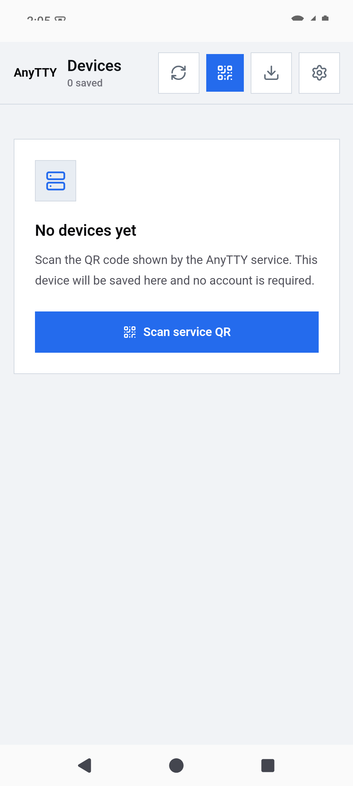

# AnyTTY

[English](README.md) | 简体中文

AnyTTY 是一个开源远程终端系统，用于访问你自己机器上的终端和文件。一个 `anytty` daemon 负责终端进程、历史记录、文件访问、设备身份和客户端授权；CLI/TUI 与移动 App 可通过 Local、SSH、Direct WebRTC 或 AnyTTY Cloud 连接它。

> **项目状态：** 尚未发布，仍在积极开发。目前没有稳定版本、兼容性保证、已发布安装包或生产就绪承诺。请从源码构建以进行开发和评估，并预期协议与配置在首次发布前仍会变化。

<p align="center"></p>

## 包含的内容

- `anytty` CLI、TUI 和当前用户 daemon。
- 共享 React 终端与文件 UI，以及 Android、iOS App 源码。
- Local socket、OpenSSH、Direct WebRTC/ICE-TCP 和 AnyTTY Cloud 客户端路由。
- 二维码配对、客户端绑定的 capability grant、端到端认证与公开 protobuf 协议。
- Cloud daemon agent，以及连接官方 AnyTTY Cloud 所需的客户端支持。

终端会话支持实时输出、保留历史、附加/分离、尺寸调整和输入处理。文件操作由 daemon 授权，并使用相同的 endpoint 模型。详见[架构](ARCHITECTURE.md)和[终端交付模型](docs/TERMINAL_DELIVERY.md)。

## 连接方式

| 路由 | 传输 | 是否需要 Cloud | 适用场景 |
| --- | --- | --- | --- |
| Local | 当前用户 socket | 否 | 同一台机器上的 CLI 与 TUI |
| SSH | OpenSSH 隧道和 loopback signaling/ICE-TCP | 否 | 已能通过 SSH 访问的机器 |
| Direct | 固定 daemon 身份和 WebRTC/ICE-TCP | 否 | 自行管理网络可达性 |
| Cloud | Edge 信令，优先 WebRTC P2P，必要时 Relay | 是 | 通过官方托管服务获得公网可达性 |

每条路由最终都连接到 daemon。Cloud 只改变发现与传输方式，不改变谁有权授予终端或文件权限。

## 架构与安全边界

```text
CLI / TUI / Mobile
        |
        | Local、SSH、Direct 或 Cloud 传输
        v
  用户拥有的 daemon  ----> PTY / shell
        |                    终端历史
        +------------------> 已授权文件根目录

仅 Cloud 路由：
client <-> 托管 Edge（信令 / relay）<-> daemon Cloud agent
```

daemon 是设备身份、终端访问、文件访问与撤销的最终权威。托管 Cloud 服务处理账号策略、daemon 注册、信令、路由选择与 Relay 传输，但不能签发 daemon 的终端或文件 capability。配对 claim 一次性使用并绑定客户端。部署或修改信任边界前，请阅读 [ARCHITECTURE.md](ARCHITECTURE.md)、[配对协议](docs/PAIRING_PROTOCOL.md)和[开源边界](docs/OPEN_SOURCE_BOUNDARY.md)。

## 从源码构建

CLI/TUI 开发需要 Go 1.26.5；共享 UI 和移动端使用 Node.js 24 及仓库中的 npm lockfile。

```sh
git clone https://github.com/lozzo/anytty.git
cd anytty
npm ci
make build
```

二进制位于 `.artifacts/bin/anytty`。主要检查命令：

```sh
make test
make test-clients
npm run public:check
```

Android release 验证还需要 Java 21 和 Android SDK。iOS 构建需要 macOS、Xcode 以及 [clients/mobile/ios/README.md](clients/mobile/ios/README.md) 中列出的环境。仓库目前不提供预编译安装包。

## 快速开始

启动当前用户的 daemon，然后打开 TUI：

```sh
./.artifacts/bin/anytty daemon start
./.artifacts/bin/anytty
```

从 CLI 创建终端并立即附加：

```sh
./.artifacts/bin/anytty terminal create --attach -- zsh
```

请使用当前 checkout 的 `./.artifacts/bin/anytty --help`，并参阅[中文快速开始](https://lozzo.github.io/anytty/zh-CN/docs/quick-start.html)。移动客户端通过扫描服务生成的一次性二维码添加 daemon；它不会登录账号或自动发现设备。

## Cloud 与自托管能力

Local、SSH 与 Direct 路由完整包含在本 Apache-2.0 仓库中，不需要 AnyTTY Cloud。使用这些路由时，主机访问、网络可达性、证书和运维由你负责。

官方 AnyTTY Cloud 是托管服务。本仓库包含 Cloud 客户端、daemon agent、公开协议和端到端授权路径，但不包含专有 Controller、Edge 实现、Cloud Web、计费、数据库迁移、生产部署或运营配置。这些服务端组件目前不作为可自托管 Cloud 栈提供。本仓库不承诺价格或服务可用性。

## 项目入口

- [中文文档站](https://lozzo.github.io/anytty/zh-CN/)和[站点源码](site/README.md)
- [贡献指南](docs/zh-CN/CONTRIBUTING.md)、[治理](docs/zh-CN/GOVERNANCE.md)和[行为准则](docs/zh-CN/CODE_OF_CONDUCT.md)
- [安全策略](docs/zh-CN/SECURITY.md)和[私密漏洞报告](https://github.com/lozzo/anytty/security/advisories/new)
- [支持](docs/zh-CN/SUPPORT.md)、[变更记录](CHANGELOG.md)和[发布检查清单](docs/zh-CN/RELEASE_CHECKLIST.md)
- [Apache-2.0 许可证原文](LICENSE)、[NOTICE](NOTICE)、[第三方声明](THIRD_PARTY_NOTICES.txt)和[商标政策](docs/zh-CN/TRADEMARKS.md)

贡献须遵守 [DCO](DCO)。Apache-2.0 不授予 AnyTTY 名称和图标的商标权。
