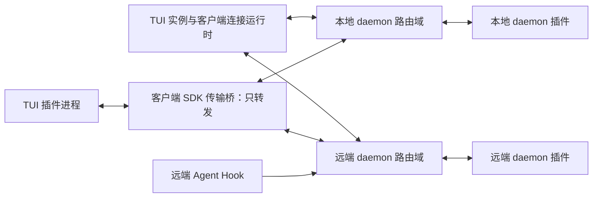
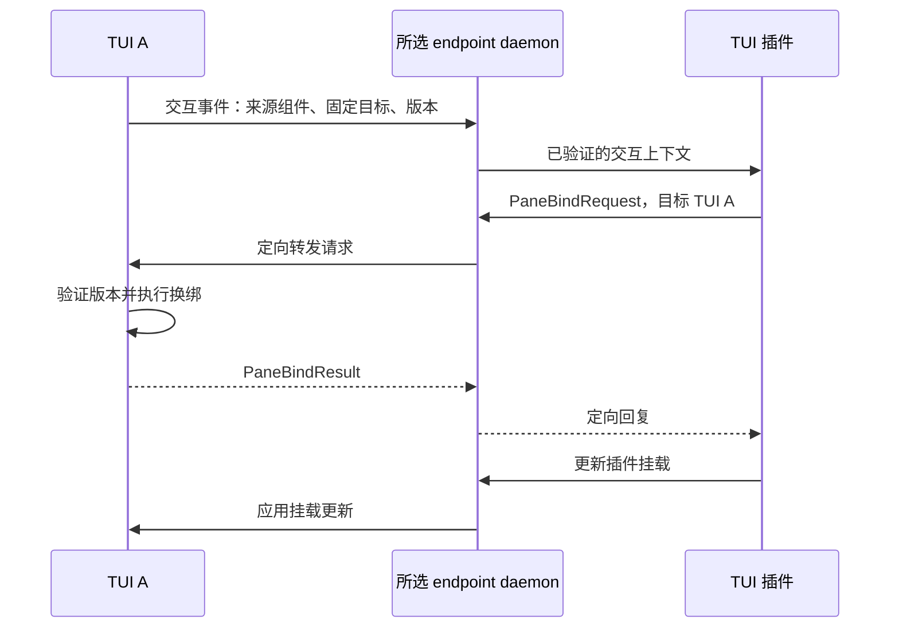

# AnyTTY 插件与 SDK 设计稿 v1

状态：修订 3；两个独立设计评审均已通过，已实施首版闭环（Protobuf + 各 endpoint daemon 统一转发）。本文同时保留后续扩展设计；当前可用 API、启动行为与明确未开放的能力以 [SDK 使用说明](../plugins/README.zh-CN.md) 为准，实际字段以 `proto/apipb/plugin.proto` 为准。独立 PTY renderer、插件创建布局容器及终端内容读取不属于本次已开放能力。

## 1. 目标与设计结论

一个插件包可以同时包含 daemon 扩展和 TUI 扩展。daemon 扩展持续维护后台能力；TUI 扩展在每个 TUI 实例中展示数据、响应交互。插件通过稳定的 SDK 读取快照、订阅事件、发出定向操作，并在声明的界面挂载点展示任意业务状态。

采用以下结构：

- 独立插件进程，Protobuf 为唯一消息契约，语言 SDK 与 CLI 使用生成的类型。
- 每个 endpoint 的 daemon 都是独立路由域。所有插件消息（包含当前 TUI 发给自己的请求、回复、交互事件和挂载更新）必须经所选 daemon 转发，无本地直达分支。
- daemon 负责本机插件后台宿主、状态服务和消息分发；每个 TUI 有自己的插件宿主与界面操作入口。
- 业务消息地址与网络连接路由分开；请求显式定向，状态事件按作用范围广播给订阅者。
- 插件读取公开数据投影，通过宿主命令修改状态；内部 reducer、终端生命周期和网络连接的所有权保持唯一。
- 界面支持声明式组件、装饰项、操作入口和独立终端界面，既能做 Agent 列表，也能做其他状态展示。

第一版验证闭环：后台接收 Agent Hook → 多个 TUI 同步显示列表及徽标 → 点击一项 → 只修改发起交互的 TUI 中指定 panel 的绑定 → 返回执行结果。

## 2. 现状与新增部分

| 当前基础 | 拟新增部分 |
| --- | --- |
| daemon 管理终端，CLI 可 capture/send/events/wait | 插件宿主、清单加载、身份注册、生命周期管理 |
| TUI 的消息 → reducer → effect → 服务调用链路 | 外部请求到内部命令的适配层、请求结果回送 |
| PaneCommand、WorkbenchCommand 等内部契约 | 公开且版本化的界面命令，不导出内部 Go 类型 |
| endpoint、terminal、surface、view 等身份 | 插件实例地址、TUI 实例租约、交互上下文 |
| 权威历史快照、分页、选区逻辑 | SDK 的 screen/history/selection 数据接口 |
| 工作台持久化及版本冲突处理 | 插件状态作用域与实例布局隔离规则 |
| 内置动作和快捷键目录 | 插件命名空间、挂载注册、冲突与可用性处理 |

代码依据：`tui/app/runtime.go`、`tui/state/root.go`、`tui/state/pane_command.go`、`tui/port/terminal.go`、`tui/port/history.go`、`tui/port/workbench_storage.go`、`tui/app/workbench_storage.go`、`client/runtime/session_owner.go`、`cmd/anytty/terminal_automation_command.go`。

## 3. 运行拓扑与所有权



一个 daemon 插件实例对应“插件 ID + 所在 daemon”；一个 TUI 插件实例对应“插件 ID + TUI 实例”。同一 TUI 插件实例可以管理多个挂载实例。

endpoint 配置、连接与 SessionOwner 继续由当前客户端运行时持有。TUI 向每个已连接 daemon 分别注册同一 TUI 实例身份，获取该路由域的租约；不把远程连接迁往本地 daemon，也不要求 daemon 之间互联。多连一个 endpoint 就多维护一份注册、租约和订阅。

消息路径始终为“发送者 → 对应 daemon → 接收者”。TUI 插件的本地 SDK 桥只负责将 Protobuf 消息运输到 daemon，不能就地 dispatch；反方向也只将已通过 daemon 路由的消息交给处理器。UI 的命中测试、实际绘制及内部 reducer 运算仍在 TUI 内，不将每个渲染像素变成 RPC，但跨插件契约的消息没有例外。

远端状态由其 owning daemon 广播到已订阅的客户端。当前客户端插件汇总各 endpoint 的数据，按稳定 daemon 身份区分；本地 daemon 不充当远端事件的必经汇聚点。没有 TUI/客户端连接时，远端插件仍工作，本机不承诺持续订阅；下次连接按快照/游标恢复。

插件后台数据归 daemon 插件所有；焦点、挂载和界面临时状态归 TUI 所有；终端生命周期归原有 daemon 核心所有。消息分发器不成为新的终端或布局状态所有者。

## 4. 身份与路由地址

### 4.1 身份分层

| 字段 | 含义与生命周期 |
| --- | --- |
| `principal_id` | 宿主认证得到的操作者身份；本地身份不能臆造为云账号 |
| `daemon_id` | 设备端 daemon 的稳定身份；进程重启另产生 boot epoch |
| `via_endpoint_id` | SDK 的出站连接选择，仅在当前客户端作用域解析；不是跨客户端地址 |
| `routing_daemon_id` | 线上路由域的稳定 daemon 身份；对端必须验证是自己 |
| `tui_instance_id` | 每次 TUI 进程启动新建；两个窗口即使来自同一用户也不同 |
| `tui_profile_id` | 可持久化的用户布局配置身份，与运行实例分离 |
| `plugin_id` | 插件包的稳定命名空间，例如 `org.example.agents` |
| `plugin_instance_id` | 每次插件进程启动的新身份，用于隔离崩溃前后的消息 |
| `mount_id` | 某次界面挂载实例的身份 |
| `workspace_id/tab_id/pane_id/view_id` | TUI 内具体目标，必须与 TUI 实例身份一起解释 |
| `terminal_ref` | 目标 daemon 身份 + terminal ID；SDK 在本地解析为 endpoint 引用 |
| `route_lease` | 当前连接注册的不可伪造路由凭据；重连后旧凭据失效 |

终端引用必须能验证 daemon 身份。不得直接把 TUI A 的 endpoint 配置 ID 交给 TUI B 解释。

### 4.2 寻址原则

消息的 Protobuf 地址包含 `routing_daemon_id`、目标 `tui_instance_id` 或 daemon 服务、`plugin_instance_id`（可选）、公开的目标 registration epoch。源注册 lease 是私密凭据，仅 SDK/宿主附加并与认证连接绑定，绝不能当作目标地址公布给其他插件。SDK 用 `via_endpoint_id` 选择连接，在线上填入已验证的 daemon 身份。另一客户端不用理解发送者的 endpoint 别名。

也可寻址到某个 daemon/TUI 的指定插件服务。路由租约由 SDK/宿主附加，通常不由业务代码拼接。日志可以展示可读地址，但可读 ID 本身不授予权限。

同一 daemon 被两个 endpoint 别名连接时，按已验证 daemon 身份 + TUI 实例 + 插件实例复用逻辑注册；更换连接显式交接 lease epoch，撤销旧连接路由，不双重订阅广播。

网络 `RouteID`、会话 generation 继续由现有 `SessionOwner` 管理。业务地址在同一 TUI 生命周期内保持稳定，连接切换只更换底层可达路径和租约，不能复用网络 RouteID 作为 TUI ID。

不使用全局 `currentTui`、`currentPane`。后台定向发送必须持有明确地址；后台自发操作还需要已授予的目标作用域。广播不能用于 panel 换绑、发送输入或结束终端。

## 5. 消息与事件契约

### 5.1 四类交互

| 类型 | 用途 | 结果语义 |
| --- | --- | --- |
| Query | 获取工作台、终端、选区、插件状态快照 | 返回数据及版本 |
| Command | 换绑、聚焦、挂载、发送输入等 | 返回成功或结构化错误；长操作返回 operation ID |
| Event | 状态已变化的通知 | 按 topic/scope 向订阅者分发 |
| Subscription | 订阅与取消，声明过滤条件和恢复游标 | 返回订阅 ID、初始版本与恢复能力 |

Query/Command 使用请求 ID、截止时间、可选幂等键、目标前置版本。Reply 关联原请求。事件包含来源、topic、作用域、日志 epoch、单调 sequence、实体版本及因果请求 ID。所有消息带协议版本和 trace ID。

源身份、返回路由、授权上下文由宿主写入或验证，不能信任插件 payload 自报身份。Reply 只返回原请求通道，不允许任意改写回送地址。

### 5.2 定向操作示例

拟议 Protobuf 信封使用 `oneof` 区分注册、查询、命令、回复、事件和订阅，核心操作使用生成的具体 message，例如 `PaneBindRequest`，不使用 JSON-RPC 方法字符串 + 任意 JSON 参数。共同元数据包含 request ID、trace ID、source/destination、路由域、租约、deadline、幂等键和 context reference。

插件私有业务数据使用带有插件命名空间、schema 名称及版本的 Protobuf bytes payload；宿主限制大小并验证声明，核心身份与 UI 操作不可藏在私有 payload 中绕过校验。共享 UI 组件树也使用 Protobuf message/oneof。

`context_ref` 指向宿主保存的交互目标与授权范围；不是任意字符串即能操作 TUI 的通行证。跨连接转发采用受限、短期委托上下文，绑定原请求、原 TUI、目标和允许的操作。

### 5.3 广播

Agent 状态变化发布到如 `plugin.org.example.agents.changed` 的 topic，scope 为对应 daemon 的插件数据集。TUI A/B 订阅后收到同一业务变化，各自更新展示。

“广播”指向匹配作用域、过滤条件且有权限的订阅者扇出，不是发送到所有用户、所有设备。插件只能发布自己命名空间内的事件；核心事件由宿主发布。

首版支持 daemon 范围与当前 TUI 范围；跨多个 daemon 的汇总由 TUI 插件显式订阅并聚合。跨用户或跨设备组的全局广播不隐式提供。

## 6. 数据同步、重连与可靠性

- 可恢复状态采用 `watchState`：原子建立快照版本与后续订阅位置，保证“读快照与订阅之间”的变化不会丢失。
- 插件通过宿主状态事务提交实体更新，宿主同时生成对应变化事件。自定义瞬时事件不承诺恢复。
- 首版状态同步发送带 revision 的完整快照，并原子建立 watch；不提供可回放事件日志或历史游标，不承诺跨 daemon 的全局顺序。delivery sequence 仅为诊断顺序。
- 队列溢出时取消 watch、标记 `RESYNC_REQUIRED`，SDK 重新建立快照订阅；daemon 重启后重新注册并读取持久状态。不得把重连或跳过 sequence 宣称为连续事件恢复。
- 单个慢插件有独立有界队列，交互请求不能静默丢弃，过载返回明确错误。未来增量日志若增加游标，需要另行约定保留窗口、去重和回放协议。
- TUI 断线时不持久排队界面变更。请求返回 `TARGET_OFFLINE`；旧交互上下文在租约失效后不可重放。
- 读请求可自动重试。写请求只在宿主声明幂等且使用同一幂等键时允许重试。宿主在有效租约内保留完成结果；重启或去重窗口失效后不宣称 exactly-once。
- 发送终端输入不是天然幂等操作。超时可能表示执行结果未知，返回 `OUTCOME_UNKNOWN`，不得自动重复发送。
- 已返回 operation ID 的长任务可查询状态、订阅完成；取消是尽力而为，已经生效的操作不因取消自动回滚。
- 标准错误包括 `NOT_FOUND`、`TARGET_OFFLINE`、`STALE_CONTEXT`、`CONFLICT`、`PERMISSION_DENIED`、`UNSUPPORTED`、`DEADLINE_EXCEEDED`、`RESOURCE_EXHAUSTED`、`RESYNC_REQUIRED`、`OUTCOME_UNKNOWN`。

## 7. 交互上下文：谁点击，修改谁

TUI 在交互触发时捕获上下文，经对应 daemon 验证并登记后投递给插件；宿主维护的不可变上下文包含：操作者、TUI 实例、插件和挂载实例、来源组件、来源面板、目标面板引用及绑定版本、所选业务项、当前关联终端、trace ID。

`source` 与 `target` 分开。点击 Agent 侧栏时，来源是侧栏，目标通常是最后一个获得焦点的内容面板；打开在独立 panel 的插件不能因为自己得到焦点，就默认覆盖自己。目标规则由宿主挂载配置决定：显式面板、打开挂载时捕获的面板、最后内容面板，或让用户选择。无法确定时返回需要选择目标，不能猜。

上下文的“当前”只表示触发时刻。后续焦点变化不改变目标；目标关闭、重新绑定或交互委托过期，返回失效/冲突。长任务想在新位置展示结果，需要新的显式操作上下文或预先声明的后台展示权限。

面板换绑流程：验证目标和权限 → 准备目标终端 attach → 在同一 TUI 消息链中重新验证绑定版本 → 提交新绑定 → 释放原绑定资源 → 回送成功并发布 `ui.pane.binding.changed`。准备失败保留原绑定；等待期间目标已变化则释放刚准备的资源并返回冲突。不是跨设备事务，也不结束原终端。

### 7.1 典型消息时序



每条交互固定所属路由域，回复、取消与后续操作沿原注册连接返回；焦点切换不改变 via endpoint。多个 daemon 同时请求修改同一面板时，由 TUI 串行执行并检查目标版本，冲突明确返回。某 endpoint 断线只失效该路由域，不能切换到另一个 daemon 重放请求。

跨 endpoint 操作由客户端显式建立新的目标路由域请求；不能把 daemon X 的委托当作 daemon Y 的授权。若插件汇总多个 Agent，列表项保存其 daemon 身份，选择后在所属连接重新建立目标操作上下文。任一 daemon 只路由自己已认证连接中的可达实例。

远端事件流程：“Agent Hook → 远端 daemon → daemon 插件处理 → 远端 daemon 状态事务及广播 → 各 TUI 插件 → 所属 daemon 转发挂载更新 → 各 TUI”。既不经本地 daemon 中转，也不从插件直接修改本机界面。

### 7.2 Hook 入口

Hook 是 daemon 插件公开的服务入口之一，不直接写插件数据库，也不自行广播 UI 命令。接收服务通过宿主注册，使用指定插件服务名和明确的 terminal reference。

宿主为需要上报的 Agent 提供作用于该终端及相应报告服务的凭据或受保护本地通道；不能把完整 TUI 控制凭据注入 Agent 环境。外部既有 Agent 的关联必须显式建立并验证，不能仅信任报告中的 terminal ID。插件校验报告 schema、来源序号与 Agent 会话身份，拒绝上一会话的迟到状态。

Hook 集成的安装/卸载与 daemon 插件启动分开：安装负责建立 Agent 侧的报告接点，启动负责恢复接收服务。没有接收服务时报告应快速失败或由集成进行有界重试，不能让 Agent 因插件不可用而阻塞。后台状态恢复后，对无法确认仍然存活的报告来源标记 unknown/stale，不能把持久化的 working 永久视为当前真值。

## 8. 界面扩展模型：任意业务状态，明确挂载位置

插件可展示任意符合数据契约的业务状态，不限于 Agent。宿主提供受控扩展位置和组件，插件不直接修改宿主内部状态树。

| 挂载点 | 能力 |
| --- | --- |
| workspace/sidebar | 树、列表、筛选、计数、任务导航 |
| panel/tab/header | 标题装饰、状态徽标、进度、快捷动作 |
| statusbar/footer | 文本、图标、计数、进度、连接状态；受宽度和优先级约束 |
| command/menu/context-menu | 动作、上下文可用性、选择项；快捷键由用户配置覆盖 |
| overlay/dialog/picker | 输入框、表单、选择器、详情、确认和错误提示 |
| panel/tab/floating 内容区 | 声明式业务页面或独立 PTY 程序 |
| notification | 瞬时通知、状态更新及点击动作 |

标准组件包含 text、badge、progress、button、list、row、card、gap、table、tree、form、layout；统一使用主题角色、稳定节点 ID、可访问标签、宿主布局与命中测试。`card` 的正文、描述、选中态和留白由节点声明，宿主只把这些通用语义映射到当前主题；`gap` 只影响布局，不产生可选中节点。大量数据用分页/虚拟化，禁止把全部历史塞入一棵界面树。

声明式更新发送 mount ID + 基础版本 + 组件树或补丁。版本不匹配时请求完整重绘。宿主把点击/选择/输入转换成带上下文的语义事件，发送到所属 daemon，由其送回插件；挂载更新也走反向的同一路径。插件不能向共享状态栏写任意 ANSI，也不能注册全局原始键盘监听。

复杂自绘 TUI 通过独立 PTY 挂载：插件拥有自身区域里的终端输入/输出，宿主保留全局导航、复制模式和布局。PTY 内容不占用用于 SDK RPC 的 stdout；使用独立受认证 IPC 通道。关闭挂载默认结束该插件 UI 子进程，后台 daemon 服务不受影响；普通终端的 detach/kill 仍遵循原语义。

同一挂载点允许多个插件并存，由宿主按用户配置、优先级和可用空间排序。插件更新只能改自己的节点与装饰；要修改核心面板绑定或标题，必须调用明确的宿主操作。

安装只登记可用挂载。状态项可声明自动挂载，完整页面默认由用户打开；同类页面支持多个 mount，各自保存过滤和选择状态。

### 8.1 挂载归属与交互

每个 MountSpec 必须携带 `via_endpoint_id`（客户端本地出站选择）、`routing_daemon_id`、`tui_instance_id` 和 owner oneof：`workspace(workspace_id)`、`tab(workspace_id,tab_id)`、`panel(workspace_id,tab_id,pane_id)`、`floating(workspace_id,tab_id,floating_id)`。owner 表达容器归属，slot 表达容器里的位置，两者不能混为一个字符串。创建独立 plugin tab/panel/floating 时由宿主返回新容器 ID，再建立 mount；不得借用另一个插件的 mount ID。

workspace 挂载跨该工作区标签切换保留；tab 挂载在标签隐藏时保留、关闭时卸载；panel 装饰随该面板销毁，换绑时收到新 terminal reference；floating 隐藏不等于关闭。切换可见性发送 daemon 转发的 visibility 事件，关闭 owner 则撤销所有从属挂载、快捷键和订阅。宿主关闭已经不存在的容器属于本地资源清理；不会在断线后偷偷执行新的插件业务请求。

MountSpec 声明焦点策略、是否可交互、首选尺寸、最小尺寸和 overflow 行为。声明式组件统一生成 click/select/submit/cancel/scroll/focus 等类型化事件，包含节点 ID、值、修饰键、owner、目标上下文和组件版本；不可用或旧版本节点不能执行动作。键盘和鼠标触发同一 action，拖拽数据明确来源与目标。

快捷键由插件声明动作及可选默认绑定，宿主按 `focused component → focused mount → panel/floating → tab → workspace → global` 的作用域解析，同层冲突不依赖注册先后，禁用冲突绑定并提供诊断。用户配置优先于插件默认，宿主保留退出、导航与复制等必要入口。插件 global 绑定须显式授权，隐藏 mount 默认不接收按键。独立 PTY 内的普通输入继续交给终端，插件不能劫持其他面板输入。

命中 action 后捕获原始交互上下文，经所属 daemon 转发到插件。组件焦点移动与原生列表滚动可由宿主组件内部处理；发往插件的所有动作、事件、数据请求和状态更新均经 daemon，无本地执行旁路。Escape 优先退出组件编辑/弹出层，再退出挂载焦点，浮窗关闭与后台任务停止分离。鼠标点击和键盘确认应有一致的可用性、错误反馈和焦点恢复。

### 8.2 自动挂载的明确规则

MountSpec 的 owner oneof 必须是具体容器引用。清单另有 owner_selector：`each_workspace`、`each_tab`、`each_panel`、`each_floating` 或 `on_demand`；自动实例化由 TUI 发现 owner 后向所属 daemon 发出注册请求，daemon 回送确认后才生效。workspace 允许 sidebar/statusbar/menu/overlay；tab 允许 header/menu/overlay/content；panel 允许 header/menu/content；floating 允许 header/menu/content。非法 owner×slot 组合拒绝注册。floating 属于 tab，切 tab 隐藏，关闭 tab 卸载。

首个 Agent 插件每个 workspace 仅一个汇总列表（owner_selector=each_workspace），默认 sidebar；同一 workspace 的多个 endpoint feed 合并在该 mount 中，以 daemon+Agent session 为行键。mount 的控制路由域在创建时固定；行的来源 endpoint 单独保存。跨域点击由 TUI 在目标行所属 daemon 建立新的交互上下文，不转用旧域凭据。面板徽标使用 each_panel，只展示该 panel 绑定终端对应 Agent；footer 扩展点可用于显示当前 workspace 各状态计数，首个插件本轮实现列表及面板徽标。

列表默认快捷键在 mount 焦点内：上下/jk 移动、Enter 打开、/ 搜索、Esc 清除搜索或返回原内容焦点；鼠标单击选择，双击打开。全局打开 Agent 列表绑定通过用户配置，不覆盖既有按键。行展示 Agent 类型、会话名、endpoint、cwd、状态与陈旧标记。等待处理置前，但正在操作的选中行身份稳定，不因排序跳到其他 Agent。使用宿主现有主题与框架。

## 9. SDK 公共能力

| SDK 模块 | 数据/操作 | 所有者与范围 |
| --- | --- | --- |
| `runtime` | 握手、能力查询、实例上下文、取消、健康状态 | 当前插件宿主 |
| `routing` | 可达目标查询、受授权定向请求 | 已认证会话，不暴露任意连接凭据 |
| `state` | snapshot/watch/transaction、插件数据模型 | 默认插件命名空间；daemon/TUI/mount 分域 |
| `events` | subscribe/publish、游标恢复 | 核心只读事件及插件自有 topic |
| `ui.workbench` | 工作区、标签页、面板树快照 | 指定 TUI 实例 |
| `ui.panes` | bind/focus/split/close/resize | 指定 TUI；关闭与终端 kill 分离 |
| `ui.mounts` | open/update/close、交互事件 | 自有挂载 |
| `ui.actions` | 声明动作处理器、启用状态 | 自有动作 ID，核心动作经公开接口调用 |
| `ui.notifications` | 通知及点击回调 | 指定 TUI 或声明的通知订阅范围 |
| `terminal` | list/create/attach/send/resize/kill 等 | owning daemon；沿用输入和尺寸权限 |
| `content` | live screen、history page/search、view snapshot、selection | 各数据源的权威快照 |
| `storage/config/log` | 配置、持久化、日志与诊断 | 插件命名空间与宿主作用域 |

内容读取必须区分：

- `terminal.screen` 是最新终端画面，提供文本或单元格/样式/光标及 revision。
- `terminal.history` 是服务端历史快照，带 token、generation、分页游标及截断/缺口信息。
- `ui.view` 是用户当前看到的那一页；用户可能正在旧历史里。
- `ui.selection` 是触发时捕获的选区文本与逻辑范围；不把内部历史 token 当成无限期资源。

读取范围按 capability 约束到终端/设备/工作区等显式目标。全历史扫描、输出订阅需单独声明并有字节上限、分页或流量控制。密码输入、进程环境、网络凭据不会作为默认上下文提供。屏幕本身可能包含敏感内容，读取屏幕不是天然安全的低权限操作。

## 10. SDK 交付形态与示例

契约统一采用 Protobuf，复用现有 `CommandEnvelope/ResultEnvelope/EventEnvelope` 及认证会话承载。协议定义 `.proto` 是唯一 schema 来源，核心命令、错误、注册及组件均生成类型。插件 stdio 使用有长度上限的 length-delimited Protobuf frame，stderr 写日志；PTY 插件使用独立受认证 IPC。所有这些传输最终连接所选 daemon，不允许 SDK 的本地调用优化绕过 daemon。

提供 Go、TypeScript SDK 和 CLI，SDK 使用生成的 Protobuf 编解码，CLI 的 JSON 输出仅用于人或脚本展示，不是消息协议。首个插件可由 Go 可执行文件实现，TypeScript SDK 用同一协议兼容性测试校验。远端 route/generation 继续由现有 SessionOwner 管理。

拟议的 TypeScript 使用方式：

```ts
// daemon 部分：只改后台状态，不认识任何“当前面板”。
await sdk.state.transaction('agents', tx => {
  tx.put(report.agentId, report); // 宿主原子生成状态变化事件
});

// TUI 部分：远端变化更新自有列表；取消信号与 mount 生命周期绑定。
const feed = await sdk.state.watch({
  daemon: selectedDaemon,
  plugin: 'org.example.agents',
  collection: 'agents',
  signal: mount.signal,
});
for await (const snapshot of feed.snapshots()) {
  await mount.update(renderAgents(snapshot));
}

// 独立注册的点击处理器：目标引用来自本次交互，非全局焦点。
sdk.ui.onAction('agents.open', async interaction => {
  const agent = await sdk.state.get({
    daemon: selectedDaemon,
    plugin: 'org.example.agents',
    collection: 'agents',
    key: interaction.itemId,
  });
  return sdk.ui.panes.bind({
    context: interaction.context,
    target: interaction.context.targetPane,
    terminal: agent.terminalRef,
    expectedBindingRevision: interaction.context.bindingRevision,
  });
});
```

所有示例 SDK 操作，包括 `mount.update` 与 `onAction` 的入站事件，均经过所属 daemon；本地缓存读取必须显式标识为缓存，不能冒充实时 Query。

以上片段分别属于后台处理器、挂载任务和动作注册；不是按顺序运行的单个主函数。SDK 对 action reply、error 和生命周期取消作统一处理。

如点击必须先经过 daemon 插件业务处理，TUI 将交互委托交给该服务。daemon 使用委托请求原 TUI 的 `ui.panes.bind`，结果沿同一请求链返回；不能通过业务项里伪造的 `tui_instance_id` 跳到别的窗口。

## 11. 安装、启动与清单

清单示例：

```toml
id = "org.example.agents"
version = "0.1.0"
api = "anytty.plugin/1"

[daemon]
command = ["./agents-service"]
start = "daemon"
restart = "on-failure"

[tui]
command = ["./agents-ui"]
start = "tui"

[capabilities]
daemon = ["state.read", "state.write", "events.subscribe", "messages.send"]
tui = ["state.read", "events.subscribe", "ui.read", "ui.mounts", "ui.panes.bind"]

[[mounts]]
id = "agent-list"
slot = "sidebar"
renderer = "declarative"
auto_mount = true

[[mounts]]
id = "agent-badge"
slot = "header"
renderer = "declarative"
auto_mount = true

[[actions]]
id = "agents.open"
label = "打开 Agent 终端"
contexts = ["agent-list"]
```

capability 名称仍需在接口清单中细化参数范围；仅字符串列表不意味着授权到所有终端或所有 TUI。清单可同时声明两部分，实际安装、启用与授权按宿主分开。

CLI 提供 install/link/list/enable/disable/uninstall/logs/doctor。首版在实例启动时读取配置，不热安装或热卸载；安装管理不会重启运行中的 daemon。远端安装必须明确 endpoint；用户打开远端终端不会自动在远端部署插件，也不会自动执行远端提供的 TUI 插件程序。首版复用同一包分别安装所需组件。

启动顺序：宿主核心就绪 → 校验已启用插件及兼容性 → 建立插件身份/通道 → 插件 ready → 注册服务或界面挂载。后台 Hook 接收入口在服务 ready 后才可用；Hook 生产者本身按 Agent 的生命周期触发，插件不假定 daemon 启动就能启动所有 Agent Hook。

插件依赖未就绪时显示 unavailable/loading，不阻塞主 TUI。禁用时撤销路由和挂载、取消订阅及未执行请求，然后宽限退出再终止进程。崩溃按退避策略有限重启并暴露错误；UI 崩溃只影响自有挂载。

### 11.1 首个 Agent 插件与 Hook 接入

依据官方文档：https://learn.chatgpt.com/docs/hooks 与 https://opencode.ai/docs/plugins/ （2026-09-11 核对）。安装器只增删本插件管理的配置项，支持显式配置目录，保留其他 Hook；测试使用隔离临时目录，不修改用户正在运行的 Codex/OpenCode 配置。

Codex 使用 hooks.json 命令 Hook：SessionStart → idle 并记录 session_id；UserPromptSubmit/PreToolUse/PostToolUse → working；PermissionRequest → blocked；Stop/Interrupt → idle（Stop 表示本轮停止，不承诺整个任务成功）；SessionEnd → exited。SubagentStop 不把父会话标成完成。Hook 通过 stdin 接受官方 JSON 后转换为生成的 Protobuf AgentReport；这是外部 Agent 的输入格式，不是 AnyTTY 内部消息格式。Stop 等要求 JSON 输出时返回 {}，不阻塞或改变审批决定。官方 Hook 存在用户信任机制，installer 应报告需要 Agent 侧认可，不能篡改信任数据库绕过。

OpenCode 安装到指定配置目录 plugins/ 的 JS/TS 插件，event 回调接收 session.created/updated/status/idle/error/deleted 和 permission.asked/replied；busy/retry → working，idle → idle，未解决 permission → blocked，错误 → error，deleted → exited。保留 sessionID 和 permission ID；多个待处理许可只在全部回应后解除 blocked。事件处理串行上报，断线有限超时，禁止拖住 OpenCode 的 agent loop。

两个适配器均从 AnyTTY 提供的 terminal 绑定上下文取得目标 daemon/terminal，并在缺少上下文时 no-op；会话 epoch 和来源序号用于拒绝旧报告。对无法从官方事件确定的进度展示 unknown，不用终端输出猜测假冒 authoritative 状态。提供安装、卸载、诊断及可重复的 Hook 事件夹具测试，并尽可能用已安装的 Codex/OpenCode 做实际加载与触发验证。

## 12. 状态持久化与多 TUI 隔离

| 数据 | 保存位置与作用范围 |
| --- | --- |
| Agent 列表、后台业务数据 | 对应 daemon 的插件命名空间 |
| 用户插件配置 | 相应安装宿主；共享需显式定义 |
| 当前焦点、对话框、mount 临时状态 | 当前 TUI 实例 |
| 页面筛选/列宽等可恢复偏好 | TUI profile + plugin + mount 恢复键 |
| 原始 terminal 生命周期/历史 | 原有 daemon 核心存储 |

现有 workbench storage 使用独立 scope、版本及 watch。实现前必须处理定向操作与共享布局之间的关系：运行中的 TUI 不得因为默认共用布局存储键，而把 A 的换绑自动套用到 B。

确定默认采用“profile 提供恢复快照，运行时布局按 TUI 实例独立”的规则。共享同一 profile 的并发保存用版本冲突处理，不做 last-write-wins；外部布局变化默认作为可载入更新，不自动覆盖另一实例的当前绑定。明确开启的协作布局另有共享语义，不能作为默认副作用。

本次实现纳入该隔离规则与迁移测试：现有持久化数据继续作为启动恢复模板，运行中外部版本事件仅记录可加载更新，不自动覆盖当前布局或绑定。插件定向操作仍经正常保存与版本冲突处理；测试必须穿过真实 watch 路径验证另一 TUI 未变化。

## 13. 权限与第三方网络扩展边界

插件 API admission 必须继承现有 core.TransportScope；首版仅允许已认证 full-access 会话注册通用插件路由，terminal-share 和 machine-events 受限会话拒绝，不能借插件消息扩大授权。插件身份、宿主能力和目标资源权限逐层验证。知道某 TUI 的地址不等于能控制它。跨用户控制默认拒绝；路由注册只接受现有已认证连接。发起交互的用户授权不能被 daemon 插件提升成可控制该用户所有 TUI 的权限。

首版插件是可信的普通 OS 子进程，不提供 OS 沙箱。capability 只限制 AnyTTY 宿主 API，不能阻止同一用户下的任意文件、网络或其他进程访问。默认不注入不必要的宿主凭据，但也不把环境裁剪当作安全隔离。

第三方网络插件分两层：

1. 普通后台服务：可运行网络逻辑，并通过公开 endpoint 操作接口提供或维护连接配置。
2. 真正的 transport provider：需要专用接口、独立能力协商和数据通道；只提交连接尝试，最终会话、generation、路由选择与鉴权仍由现有 Client Engine/SessionOwner 所有。

首版可承载普通后台网络服务；完整 transport provider 不与通用 UI 事件协议混用，作为后续专门设计项。高吞吐终端字节流仍走现有数据通道，不穿过插件控制消息广播总线。

## 14. 可观测性、兼容性与故障处理

提供插件清单、实例列表、挂载列表、订阅列表、路由在线状态和最近错误。每条操作可用 trace ID 关联“点击 → daemon → 插件 → daemon → TUI → daemon → 结果”。日志默认记方法、目标、耗时和错误，不记录选区全文或终端输入正文。

主协议版本不兼容则拒绝启动；新增方法和组件通过 capability 协商，缺少某挂载点时允许降级到独立 panel 或显示不支持。插件私有事件及数据 schema 自行版本化，但仍受消息大小和流量配额约束。

TUI 退出不会停止 daemon 插件。daemon 断线时挂载保留最近快照并标记陈旧，恢复后重新同步。后台长任务需要在 daemon 中自行持久化任务身份，不能把 TUI 请求连接当成任务寿命。

首版 Agent 聚合界面的明确限制：数据源按 endpoint 独立同步，但界面挂载固定归属首次完成 Init 的 control daemon。普通数据源断线仅影响其 Agent；control 断线会暂停整个聚合列表与徽标的交互，其他在线数据源不会自动接管挂载。恢复时通过 Init 的自有挂载权威版本和宿主业务确认重新同步。跨 daemon 自动迁移尚未实现，不能以放宽 mount 来源校验代替；后续需宿主授予挂载组及控制代际，并原子撤销旧挂载和交互上下文。

## 15. 实施切分与验收

全部阶段需在本设计获批后开始；以下是实施顺序，不代表已授权动工。

1. 固定身份、路由、能力与 Protobuf schema；实现最小宿主、SDK 请求/回复和实例注册。
2. 实现 daemon 插件状态/watch 与重连语义；用独立 SDK 测试程序验证，不先耦合 UI。
3. 接入 TUI 定向命令、交互上下文、panel 换绑与布局隔离。
4. 实现第一批共享界面挂载：侧栏列表、面板徽标、状态栏、动作入口、通知及 picker；验证通用组件机制。
5. 扩展独立 PTY 页面、表单与表格树组件，补齐安装管理、Go/TypeScript SDK、CLI 和文档。

验收必须至少包含：

- 同 TUI 自发自收的交互、Query、挂载更新和 Reply 均在 daemon 中有可验证路由记录；断开 daemon 后不得本地执行成功。
- Codex 与 OpenCode 官方 Hook/插件事件接入首个 Agent 工作台，展示真实来源状态，不能把仅会话身份事件伪装为完整生命周期。

- 同一 daemon 连两个 TUI；状态广播两边可见，A 点击只换绑 A，且经过存储 watch 后 B 仍不变化。
- 同一 TUI 连两个 daemon；同名 terminal ID 不串设备；endpoint 别名不同仍能正确解析稳定身份。
- 点击侧栏和独立插件 panel 时，source/target 规则一致；焦点切换、面板关闭和换绑竞争均有确定结果。
- 断线、daemon/TUI/plugin 重启后旧租约和旧上下文失效，旧请求不能控制新进程。
- 快照与订阅之间不丢状态；重复、过期游标、乱序来源与慢订阅者正确恢复或报错。
- 重复写请求不重复换绑；输入超时不自动重发；插件无法广播执行破坏性操作。
- 同插件同时挂载列表、徽标和状态栏，更新互不覆盖，取消某 mount 不关闭其他挂载。
- 插件崩溃不阻塞宿主输入，后台没有 TUI 时继续工作，禁用后资源和订阅释放。
- 选区读取返回触发时内容，旧历史视图与 live screen 区分清楚，分页上限与缺口信息保留。
- 非授权目标、伪造来源、过期委托、版本不匹配均返回稳定错误；跨用户消息不泄漏。

## 16. 本次评审需确认的决定

1. 同一插件包可包含 daemon 与 TUI 两个独立生命周期组件。
2. 每个 endpoint 独立注册 TUI；所有插件请求、回复与事件经该 daemon 转发，包括同 TUI 自发自收。
3. 采用声明式共享组件 + 独立 PTY 页面；开放多种状态展示挂载点，禁止直接改内部状态树。
4. Protobuf 为唯一在线消息协议，提供 Go、TypeScript SDK 和 CLI；初版是可信进程模型。
5. 默认运行实例布局独立，明确处理已有 workbench 持久化同步的兼容与迁移。
6. 完整网络 transport provider 留作专项设计，首版支持后台网络服务和现有 endpoint 能力调用。
